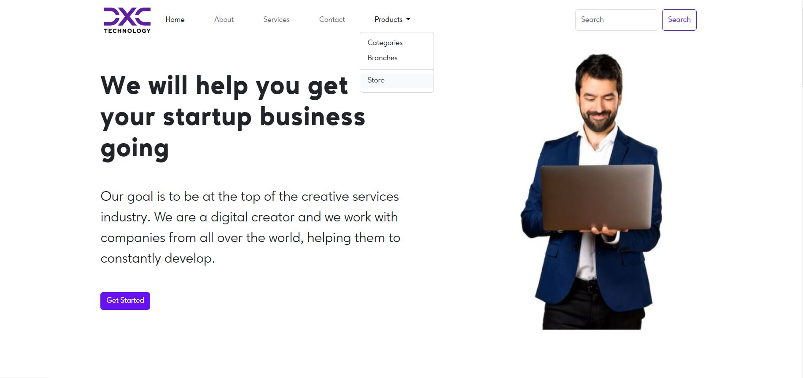
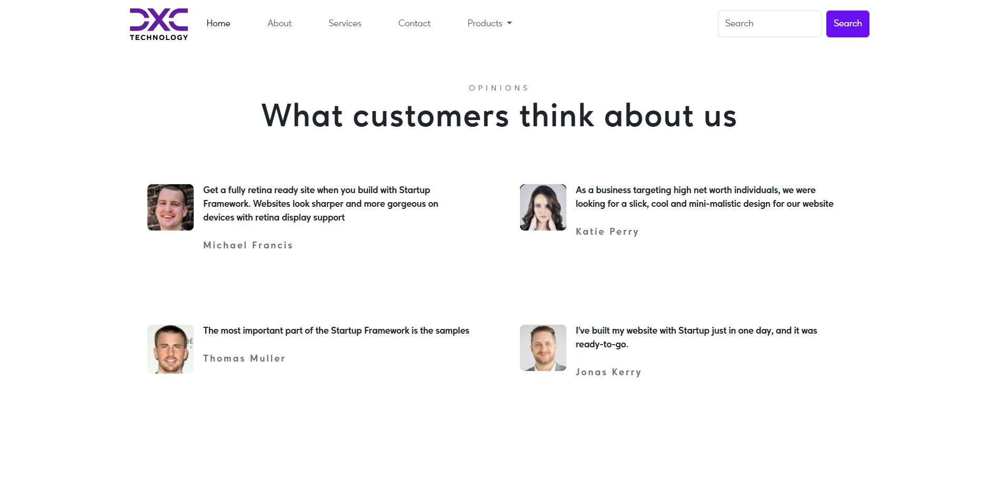
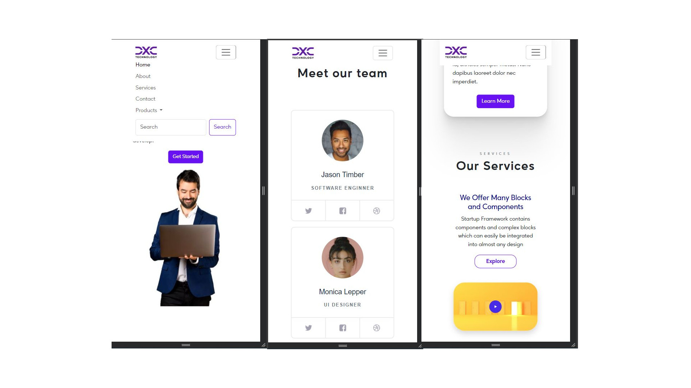

# Landing-Page

Hello, this my project of Landing-page. I made this project with
bootstrap ,sass andcss features like
  * flex,
  * clamp,
  * transform or,
  * clip-path.

# The challenge

- Create Landing-Page responsive and good-looking on every display

# Link

- Live Site URL: <a class="d-inline-block mx-2" href="https://marcinmierzwa.github.io/Landing-Page/">Dashboard
  </a>

# Built with

- HTML5
- CSS3
- SASS
- Bootstrap
